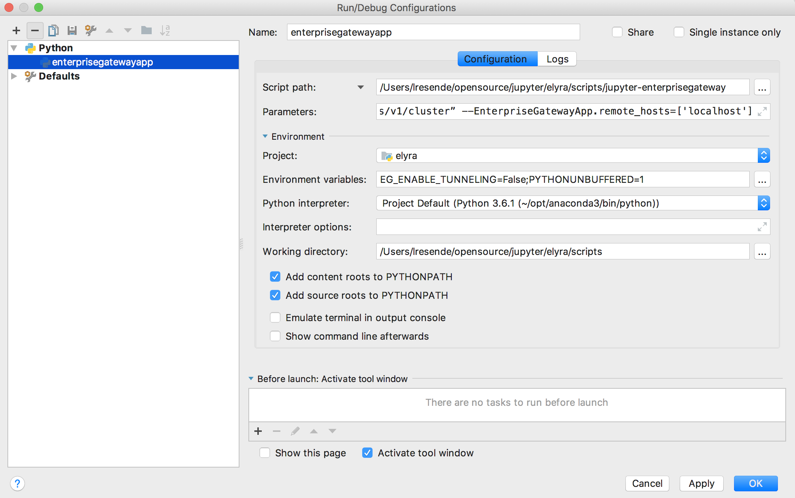

# Debugging Jupyter Enterprise Gateway

This page discusses how to go about debugging Enterprise Gateway. We also provide troubleshooting information
in our [Troubleshooting Guide](../other/troubleshooting.md).

## Configuring your IDE

While your mileage may vary depending on which IDE you are using, the steps below (using PyCharm as an example) should be useful for configuring a debugging session for Enterprise Gateway with minimum
adjustments for different IDEs.

### Creating a new Debug Configuration

Go to Run->Edit Configuration and create a new python configuration with the following settings:



**Script Path:**

```bash
/Users/jovyan/opensource/jupyter/elyra/scripts/jupyter-enterprisegateway
```

**Parameters:**

```bash
--ip=0.0.0.0
--log-level=DEBUG
--EnterpriseGatewayApp.yarn_endpoint=“http://elyra-fyi-node-1.fyre.ibm.com:8088/ws/v1/cluster”
--EnterpriseGatewayApp.remote_hosts=['localhost']
```

**Environment Variables:**

```bash
EG_ENABLE_TUNNELING=False
```

**Working Directory:**

```bash
/Users/jovyan/opensource/jupyter/elyra/scripts
```

### Running in debug mode

Now that you have handled the necessary configuration, use Run-Debug and select the debug configuration
you just created and happy debugging!
