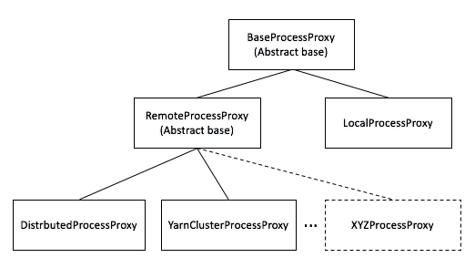

# System Architecture

Below are sections presenting details of the Enterprise Gateway internals and other related items. While we will attempt to maintain its consistency, the ultimate answers are in the code itself.

## Enterprise Gateway Process Proxy Extensions

Enterprise Gateway is follow-on project to Jupyter Kernel Gateway with additional abilities to support remote kernel sessions on behalf of multiple users within resource-managed frameworks such as [Apache Hadoop YARN](https://hadoop.apache.org/docs/current/hadoop-yarn/hadoop-yarn-site/YARN.html) or [Kubernetes](https://kubernetes.io/). Enterprise Gateway introduces these capabilities by extending the existing class hierarchies for `AsyncKernelManager` and `AsyncMultiKernelManager` classes, along with an additional abstraction known as a _process proxy_.

### Overview

At its basic level, a running kernel consists of two components for its communication - a set of ports and a process.

### Kernel Ports

The first component is a set of five zero-MQ ports used to convey the Jupyter protocol between the Notebook
and the underlying kernel. In addition to the 5 ports, is an IP address, a key, and a signature scheme
indicator used to interpret the key. These eight pieces of information are conveyed to the kernel via a
json file, known as the connection file.

Within the base framework, the IP address must be a local IP address meaning that the kernel cannot be
remote from the library launching the kernel. The enforcement of this restriction is down in the `jupyter_client` module - two levels below Enterprise Gateway.

This component is the core communication mechanism between the Notebook and the kernel. All aspects, including
lifecycle management, can occur via this component. The kernel process (below) comes into play only when
port-based communication becomes unreliable or additional information is required.

### Kernel Process

When a kernel is launched, one of the fields of the kernel's associated kernel specification is used to
identify a command to invoke. In today's implementation, this command information, along with other
environment variables (also described in the kernel specification), is passed to `popen()` which returns
a process class. This class supports four basic methods following its creation:

1. `poll()` to determine if the process is still running
1. `wait()` to block the caller until the process has terminated
1. `send_signal(signum)` to send a signal to the process
1. `kill()` to terminate the process

As you can see, other forms of process communication can be achieved by abstracting the launch mechanism.

### Kernel Specifications

The primary vehicle for indicating a given kernel should be handled in a different manner is the kernel
specification, otherwise known as the _kernel spec_. Enterprise Gateway leverages the natively extensible `metadata` stanza within the kernel specification to introduce a new stanza named `process_proxy`.

The `process_proxy` stanza identifies the class that provides the kernel's process abstraction
(while allowing for future extensions). This class then provides the kernel's lifecycle management operations relative to the managed resource or functional equivalent.

Here's an example of a kernel specification that uses the `DistributedProcessProxy` class for its abstraction:

```json
{
  "language": "scala",
  "display_name": "Spark - Scala (YARN Client Mode)",
  "metadata": {
    "process_proxy": {
      "class_name": "enterprise_gateway.services.processproxies.distributed.DistributedProcessProxy"
    }
  },
  "env": {
    "SPARK_HOME": "/usr/hdp/current/spark2-client",
    "__TOREE_SPARK_OPTS__": "--master yarn --deploy-mode client --name ${KERNEL_ID:-ERROR__NO__KERNEL_ID}",
    "__TOREE_OPTS__": "",
    "LAUNCH_OPTS": "",
    "DEFAULT_INTERPRETER": "Scala"
  },
  "argv": [
    "/usr/local/share/jupyter/kernels/spark_scala_yarn_client/bin/run.sh",
    "--RemoteProcessProxy.kernel-id",
    "{kernel_id}",
    "--RemoteProcessProxy.response-address",
    "{response_address}",
    "--RemoteProcessProxy.public-key",
    "{public_key}"
  ]
}
```

See the [Process Proxy](#process-proxy) section for more details on process proxies and those provided as part of the Enterprise Gateway release.

## Remote Mapping Kernel Manager

`RemoteMappingKernelManager` is a subclass of Jupyter Server's [`AsyncMappingKernelManager`](https://github.com/jupyter-server/jupyter_server/blob/745f5ba3f00280c1e1900326a7e08463d48a3912/jupyter_server/services/kernels/kernelmanager.py#L633) and provides two functions.

1. It provides the vehicle for making the `RemoteKernelManager` class known and available.
1. It overrides `start_kernel` to look at the target kernel's kernel spec to see if it contains a remote process proxy class entry. If so, it records the name of the class in its member variable to be made available to the kernel start logic.

## Remote Kernel Manager

`RemoteKernelManager` is a subclass of jupyter_client's [`AsyncIOLoopKernelManager` class](https://github.com/jupyter/jupyter_client/blob/10decd25308c306b6005cbf271b96493824a83e8/jupyter_client/ioloop/manager.py#L62) and provides the
primary integration points for remote process proxy invocations. It implements a number of methods which allow
Enterprise Gateway to circumvent functionality that might otherwise be prevented. As a result, some of these overrides may
not be necessary if lower layers of the Jupyter framework were modified. For example, some methods are required
because Jupyter makes assumptions that the kernel process is local.

Its primary functionality, however, is to override the `_launch_kernel` method (which is the method closest to
the process invocation) and instantiates the appropriate process proxy instance - which is then returned in
place of the process instance used in today's implementation. Any interaction with the process then takes
place via the process proxy.

Both `RemoteMappingKernelManager` and `RemoteKernelManager` class definitions can be found in
[remotemanager.py](https://github.com/jupyter-server/enterprise_gateway/blob/main/enterprise_gateway/services/kernels/remotemanager.py)

## Process Proxy

Process proxy classes derive from the abstract base class `BaseProcessProxyABC` - which defines the four basic
process methods. There are two immediate subclasses of `BaseProcessProxyABC` - `LocalProcessProxy`
and `RemoteProcessProxy`.

`LocalProcessProxy` is essentially a pass-through to the current implementation. Kernel specifications that do not contain
a `process_proxy` stanza will use `LocalProcessProxy`.

`RemoteProcessProxy` is an abstract base class representing remote kernel processes. Currently, there are seven
built-in subclasses of `RemoteProcessProxy` ...

- `DistributedProcessProxy` - largely a proof of concept class, `DistributedProcessProxy` is responsible for the launch
  and management of kernels distributed across an explicitly defined set of hosts using ssh. Hosts are determined
  via a round-robin algorithm (that we should make pluggable someday).
- `YarnClusterProcessProxy` - is responsible for the discovery and management of kernels hosted as Hadoop YARN applications
  within a managed cluster.
- `KubernetesProcessProxy` - is responsible for the discovery and management of kernels hosted
  within a Kubernetes cluster.
- `DockerSwarmProcessProxy` - is responsible for the discovery and management of kernels hosted
  within a Docker Swarm cluster.
- `DockerProcessProxy` - is responsible for the discovery and management of kernels hosted
  within Docker configuration. Note: because these kernels will always run local to the corresponding Enterprise Gateway instance, these process proxies are of limited use.
- `ConductorClusterProcessProxy` - is responsible for the discovery and management of kernels hosted
  within an IBM Spectrum Conductor cluster.
- `SparkOperatorProcessProxy` - is responsible for the discovery and management of kernels hosted
  within a Kubernetes cluster but created as a `SparkApplication` instead of a Pod. The `SparkApplication` is a Kubernetes custom resource
  defined inside the project [spark-on-k8s-operator](https://github.com/GoogleCloudPlatform/spark-on-k8s-operator), which
  makes all kinds of spark on k8s components better organized and easy to configure.

```{note}
Before you run a kernel associated with `SparkOperatorProcessProxy`, ensure that the [Kubernetes Operator for Apache Spark is installed](https://github.com/GoogleCloudPlatform/spark-on-k8s-operator#installation) in your Kubernetes cluster.
```

You might notice that the last six process proxies do not necessarily control the _launch_ of the kernel. This is
because the native jupyter framework is utilized such that the script that is invoked by the framework is what
launches the kernel against that particular resource manager. As a result, the _startup time_ actions of these process
proxies is more about discovering where the kernel _landed_ within the cluster in order to establish a mechanism for
determining lifetime. _Discovery_ typically consists of using the resource manager's API to locate the kernel whose name includes its kernel ID
in some fashion.

On the other hand, the `DistributedProcessProxy` essentially wraps the kernel specification's argument vector (i.e., invocation
string) in a remote shell since the host is determined by Enterprise Gateway, eliminating the discovery step from
its implementation.

These class definitions can be found in the
[processproxies package](https://github.com/jupyter-server/enterprise_gateway/blob/main/enterprise_gateway/services/processproxies). However,
Enterprise Gateway is architected such that additional process proxy implementations can be provided and are not
required to be located within the Enterprise Gateway hierarchy - i.e., we embrace a _bring your own process proxy_ model.



The process proxy constructor looks as follows:

```python
def __init__(self, kernel_manager, proxy_config):
```

where

- `kernel_manager` is an instance of a `RemoteKernelManager` class.
- `proxy_config` is a dictionary of configuration values present in the `kernel.json` file. These
  values can be used to override or amend various global configuration values on a per-kernel basis. See
  [Process Proxy Configuration](#process-proxy-configuration) for more information.

```python
@abstractmethod
def launch_process(self, kernel_cmd, *kw):
```

where

- `kernel_cmd` is a list (argument vector) that should be invoked to launch the kernel. This parameter is
  an artifact of the kernel manager `_launch_kernel()` method.
- `**kw` is a set keyword arguments which includes an `env` dictionary element consisting of the names
  and values of which environment variables to set at launch time.

The `launch_process()` method is the primary method exposed on the Process Proxy classes. It's responsible for
performing the appropriate actions relative to the target type. The process must be in a running state prior
to returning from this method - otherwise attempts to use the connections will not be successful since the
(remote) kernel needs to have created the sockets.

All process proxy subclasses should ensure `BaseProcessProxyABC.launch_process()` is called - which will automatically
place a variable named `KERNEL_ID` (consisting of the kernel's unique ID) into the corresponding kernel's environment
variable list since `KERNEL_ID` is a primary mechanism for associating remote applications to a specific kernel instance.

```python
def poll(self):
```

The `poll()` method is used by the Jupyter framework to determine if the process is still alive. By default, the
framework's heartbeat mechanism calls `poll()` every 3 seconds. This method returns `None` if the process is still running, `False` otherwise (per the `popen()` contract).

```python
def wait(self):
```

The `wait()` method is used by the Jupyter framework when terminating a kernel. Its purpose is to block return
to the caller until the process has terminated. Since this could be awhile, it's best to return control in a
reasonable amount of time since the kernel instance is destroyed anyway. This method does not return a value.

```python
def send_signal(self, signum):
```

The `send_signal()` method is used by the Jupyter framework to send a signal to the process. Currently, `SIGINT (2)`
(to interrupt the kernel) is the signal sent.

It should be noted that for normal processes - both local and remote - `poll()` and `kill()` functionality can
be implemented via `send_signal` with `signum` values of `0` and `9`, respectively.

This method returns `None` if the process is still running, `False` otherwise.

```python
def kill(self):
```

The `kill()` method is used by the Jupyter framework to terminate the kernel process. This method is only necessary when the request to shutdown the kernel - sent via the control port of the zero-MQ ports - does not respond in an appropriate amount of time.

This method returns `None` if the process is killed successfully, `False` otherwise.

### RemoteProcessProxy

As noted above, `RemoteProcessProxy` is an abstract base class that derives from `BaseProcessProxyABC`. Subclasses
of `RemoteProcessProxy` must implement two methods - `confirm_remote_startup()` and `handle_timeout()`:

```python
@abstractmethod
def confirm_remote_startup(self, kernel_cmd, **kw):
```

where

- `kernel_cmd` is a list (argument vector) that should be invoked to launch the kernel. This parameter is an
  artifact of the kernel manager `_launch_kernel()` method.
- `**kw` is a set key-word arguments.

`confirm_remote_startup()` is responsible for detecting that the remote kernel has been appropriately launched and is ready to receive requests. This can include gathering application status from the remote resource manager but is really a function of having received the connection information from the remote kernel launcher. (See [Kernel Launchers](#kernel-launchers))

```python
@abstractmethod
def handle_timeout(self):
```

`handle_timeout()` is responsible for detecting that the remote kernel has failed to startup in an acceptable time. It
should be called from `confirm_remote_startup()`. If the timeout expires, `handle_timeout()` should throw HTTP
Error 500 (`Internal Server Error`).

Kernel launch timeout expiration is expressed via the environment variable `KERNEL_LAUNCH_TIMEOUT`. If this
value does not exist, it defaults to the Enterprise Gateway process environment variable `EG_KERNEL_LAUNCH_TIMEOUT` - which
defaults to 30 seconds if unspecified. Since all `KERNEL_` environment variables "flow" from the Notebook server, the launch
timeout can be specified as a client attribute of the Notebook session.

#### YarnClusterProcessProxy

As part of its base offering, Enterprise Gateway provides an implementation of a process proxy that communicates with the Hadoop YARN resource manager that has been instructed to launch a kernel on one of its worker nodes. The node on which the kernel is launched is up to the resource manager - which enables an optimized distribution of kernel resources.

Derived from `RemoteProcessProxy`, `YarnClusterProcessProxy` uses the `yarn-api-client` library to locate the kernel and monitor its lifecycle. However, once the kernel has returned its connection information, the primary kernel operations naturally take place over the ZeroMQ ports.

This process proxy is reliant on the `--EnterpriseGatewayApp.yarn_endpoint` command line option or the `EG_YARN_ENDPOINT` environment variable to determine where the YARN resource manager is located. To accommodate increased flexibility, the endpoint definition can be defined within the process proxy stanza of the kernel specification, enabling the ability to direct specific kernels to different YARN clusters.

In cases where the YARN cluster is configured for high availability, then the `--EnterpriseGatewayApp.alt_yarn_endpoint` command line option or the `EG_ALT_YARN_ENDPOINT` environment variable should also be defined. When set, the underlying `yarn-api-client` library will choose the active Resource Manager between the two.

```{note}
If Enterprise Gateway is running on an edge node of the cluster and has a valid `yarn-site.xml` file in HADOOP_CONF_DIR, neither of these values are required (default = None).  In such cases, the `yarn-api-client` library will choose the active Resource Manager from the configuration files.
```

```{seealso}
[Hadoop YARN deployments](../operators/deploy-yarn-cluster.md) in the Operators Guide for details.
```

#### DistributedProcessProxy

Like `YarnClusterProcessProxy`, Enterprise Gateway also provides an implementation of a basic
round-robin remoting mechanism that is part of the `DistributedProcessProxy` class. This class
uses the `--EnterpriseGatewayApp.remote_hosts` command line option (or `EG_REMOTE_HOSTS`
environment variable) to determine on which hosts a given kernel should be launched. It uses
a basic round-robin algorithm to index into the list of remote hosts for selecting the target
host. It then uses ssh to launch the kernel on the target host. As a result, all kernel specification
files must reside on the remote hosts in the same directory structure as on the Enterprise
Gateway server.

It should be noted that kernels launched with this process proxy run in YARN _client_ mode - so their
resources (within the kernel process itself) are not managed by the Hadoop YARN resource manager.

Like the yarn endpoint parameter the `remote_hosts` parameter can be specified within the
process proxy configuration to override the global value - enabling finer-grained kernel distributions.

```{seealso}
[Distributed deployments](../operators/deploy-distributed.md) in the Operators Guide for details.
```

#### KubernetesProcessProxy

With the popularity of Kubernetes within the enterprise, Enterprise Gateway provides an implementation
of a process proxy that communicates with the Kubernetes resource manager via the Kubernetes API. Unlike
the other offerings, in the case of Kubernetes, Enterprise Gateway is itself deployed within the Kubernetes
cluster as a _Service_ and _Deployment_. The primary vehicle by which this is accomplished is via [Helm](https://helm.sh/) and Enterprise Gateway provides a set of [helm chart](https://github.com/jupyter-server/enterprise_gateway/tree/main/etc/kubernetes/helm/enterprise-gateway) files to simplify deployment.

```{seealso}
[Kubernetes deployments](../operators/deploy-kubernetes.md) in the Operators Guide for details.
```

#### DockerSwarmProcessProxy

Enterprise Gateway provides an implementation of a process proxy that communicates with the Docker Swarm resource manager via the Docker API. When used, the kernels are launched as swarm services and can reside anywhere in the managed cluster. To leverage kernels configured in this manner, Enterprise Gateway can be deployed
either as a Docker Swarm _service_ or a traditional Docker container.

A similar `DockerProcessProxy` implementation has also been provided. When used, the corresponding kernel will be launched as a traditional docker container that runs local to the launching Enterprise Gateway instance. As a result, its use has limited value.

```{seealso}
[Docker and Docker Swarm deployments](../operators/deploy-docker.md) in the Operators Guide for details.
```

#### ConductorClusterProcessProxy

Enterprise Gateway also provides an implementation of a process proxy
that communicates with an IBM Spectrum Conductor resource manager that has been instructed to launch a kernel
on one of its worker nodes. The node on which the kernel is launched is up to the resource
manager - which enables an optimized distribution of kernel resources.

Derived from `RemoteProcessProxy`, `ConductorClusterProcessProxy` uses Conductor's REST-ful API
to locate the kernel and monitor its life-cycle. However, once the kernel has returned its
connection information, the primary kernel operations naturally take place over the ZeroMQ ports.

This process proxy is reliant on the `--EnterpriseGatewayApp.conductor_endpoint` command line
option or the `EG_CONDUCTOR_ENDPOINT` environment variable to determine where the Conductor resource manager is
located.

```{seealso}
[IBM Spectrum Conductor deployments](../operators/deploy-conductor.md) in the Operators Guide for details.
```

#### CustomResourceProcessProxy

Enterprise Gateway also provides a implementation of a process proxy derived from `KubernetesProcessProxy`
called `CustomResourceProcessProxy`.

Instead of creating kernels based on a Kubernetes pod, `CustomResourceProcessProxy`
manages kernels via a custom resource definition (CRD). For example, `SparkApplication` is a CRD that includes
many components of a Spark-on-Kubernetes application.

If you are going to extend `CustomResourceProcessProxy`, just follow steps below:

- override custom resource related variables(i.e. `group`, `version` and `plural`
  and `get_container_status` method, wrt [launch_kubernetes.py](https://github.com/jupyter-server/enterprise_gateway/blob/main/etc/kernel-launchers/kubernetes/scripts/launch_kubernetes.py).

- define a jinja template like
  [kernel-pod.yaml.j2](https://github.com/jupyter-server/enterprise_gateway/blob/main/etc/kernel-launchers/kubernetes/scripts/kernel-pod.yaml.j2).
  As a generic design, the template file should be named as {crd_group}-{crd_version} so that you can reuse
  [launch_kubernetes.py](https://github.com/jupyter-server/enterprise_gateway/blob/main/etc/kernel-launchers/kubernetes/scripts/launch_kubernetes.py) in the kernelspec.

- define a kernel specification like [spark_python_operator/kernel.json](https://github.com/jupyter-server/enterprise_gateway/blob/main/etc/kernelspecs/spark_python_operator/kernel.json).

### Process Proxy Configuration

Each `kernel.json`'s `process-proxy` stanza can specify an optional `config` stanza that is converted
into a dictionary of name/value pairs and passed as an argument to each process-proxy constructor
relative to the class identified by the `class_name` entry.

How each dictionary entry is interpreted is completely a function of the constructor relative to that process-proxy
class or its superclass. For example, an alternate list of remote hosts has meaning to the `DistributedProcessProxy` but
not to its superclasses. As a result, the superclass constructors will not attempt to interpret that value.

In addition, certain dictionary entries can override or amend system-level configuration values set on the command-line, thereby
allowing administrators to tune behaviors down to the kernel level. For example, an administrator might want to
constrain Python kernels configured to use specific resources to an entirely different set of hosts (and ports) that other
remote kernels might be targeting in order to isolate valuable resources. Similarly, an administrator might want to
only authorize specific users to a given kernel.

In such situations, one might find the following `process-proxy` stanza:

```json
{
  "metadata": {
    "process_proxy": {
      "class_name": "enterprise_gateway.services.processproxies.distributed.DistributedProcessProxy",
      "config": {
        "remote_hosts": "priv_host1,priv_host2",
        "port_range": "40000..41000",
        "authorized_users": "bob,alice"
      }
    }
  }
}
```

In this example, the kernel associated with this `kernel.json` file is relegated to the hosts `priv_host1` and `priv_host2`
where kernel ports will be restricted to a range between `40000` and `41000` and only users `bob` and `alice` can
launch such kernels (provided neither appear in the global set of `unauthorized_users` since denial takes precedence).

For a current enumeration of which system-level configuration values can be overridden or amended on a per-kernel basis
see [Per-kernel overrides](../operators/config-kernel-override.md).

## Kernel Launchers

As noted above, a kernel is considered started once the `launch_process()` method has conveyed its connection information back to the Enterprise Gateway server process. Conveyance of connection information from a remote kernel is the responsibility of the remote kernel _launcher_.

Kernel launchers provide a means of normalizing behaviors across kernels while avoiding kernel modifications. Besides providing a location where connection file creation can occur, they also provide a 'hook' for other kinds of behaviors - like establishing virtual environments or sandboxes, providing collaboration behavior, adhering to port range restrictions, etc.

There are four primary tasks of a kernel launcher:

1. Creation of the connection file and ZMQ ports on the remote (target) system along with a _gateway listener_ socket
1. Conveyance of the connection (and listener socket) information back to the Enterprise Gateway process
1. Invocation of the target kernel
1. Listen for interrupt and shutdown requests from Enterprise Gateway and carry out the action when appropriate

Kernel launchers are minimally invoked with three parameters (all of which are conveyed by the `argv` stanza of the corresponding `kernel.json` file) - the kernel's ID as created by the server and conveyed via the placeholder `{kernel_id}`, a response address consisting of the Enterprise Gateway server IP and port on which to return the connection information similarly represented by the placeholder `{response_address}`, and a public-key used by the launcher to encrypt an AES key that encrypts the kernel's connection information back to the server and represented by the placeholder `{public_key}`.

The kernel's ID is identified by the parameter `--RemoteProcessProxy.kernel-id`. Its value (`{kernel_id}`) is essentially used to build a connection file to pass to the to-be-launched kernel, along with any other things - like log files, etc.

The response address is identified by the parameter `--RemoteProcessProxy.response-address`. Its value (`{response_address}`) consists of a string of the form `<IPV4:port>` where the IPV4 address points back to the Enterprise Gateway server - which is listening for a response on the provided port. The port's default value is `8877`, but can be specified via the environment variable `EG_RESPONSE_PORT`.

The public key is identified by the parameter `--RemoteProcessProxy.public-key`. Its value (`{public_key}`) is used to encrypt an AES key created by the launcher to encrypt the kernel's connection information. The server, upon receipt of the response, uses the corresponding private key to decrypt the AES key, which it then uses to decrypt the connection information. Both the public and private keys are ephemeral; created upon Enterprise Gateway's startup. They can be ephemeral because they are only needed during a kernel's startup and never again.

Here's a [kernel.json](https://github.com/jupyter-server/enterprise_gateway/blob/main/etc/kernelspecs/spark_python_yarn_cluster/kernel.json) file illustrating these parameters...

```json
{
  "language": "python",
  "display_name": "Spark - Python (YARN Cluster Mode)",
  "metadata": {
    "process_proxy": {
      "class_name": "enterprise_gateway.services.processproxies.yarn.YarnClusterProcessProxy"
    }
  },
  "env": {
    "SPARK_HOME": "/usr/hdp/current/spark2-client",
    "SPARK_OPTS": "--master yarn --deploy-mode cluster --name ${KERNEL_ID:-ERROR__NO__KERNEL_ID} --conf spark.yarn.submit.waitAppCompletion=false",
    "LAUNCH_OPTS": ""
  },
  "argv": [
    "/usr/local/share/jupyter/kernels/spark_python_yarn_cluster/bin/run.sh",
    "--RemoteProcessProxy.kernel-id",
    "{kernel_id}",
    "--RemoteProcessProxy.response-address",
    "{response_address}",
    "--RemoteProcessProxy.public-key",
    "{public_key}"
  ]
}
```

Other options supported by launchers include:

- `--RemoteProcessProxy.port-range {port_range}` - passes configured port-range to launcher where launcher applies that range to kernel ports. The port-range may be configured globally or on a per-kernel specification basis, as previously described.

- `--RemoteProcessProxy.spark-context-initialization-mode [lazy|eager|none]` - indicates the _timeframe_ in which the spark context will be created.

  - `lazy` (default) attempts to defer initialization as late as possible - although this can vary depending on the
    underlying kernel and launcher implementation.
  - `eager` attempts to create the spark context as soon as possible.
  - `none` skips spark context creation altogether.

  Note that some launchers may not be able to support all modes. For example, the scala launcher uses the Apache Toree
  kernel - which currently assumes a spark context will exist. As a result, a mode of `none` doesn't apply.
  Similarly, the `lazy` and `eager` modes in the Python launcher are essentially the same, with the spark context
  creation occurring immediately, but in the background thereby minimizing the kernel's startup time.

Kernel.json files also include a `LAUNCH_OPTS:` section in the `env` stanza to allow for custom
parameters to be conveyed in the launcher's environment. `LAUNCH_OPTS` are then referenced in
the [run.sh](https://github.com/jupyter-server/enterprise_gateway/blob/main/etc/kernelspecs/spark_python_yarn_cluster/bin/run.sh)
script as the initial arguments to the launcher
(see [launch_ipykernel.py](https://github.com/jupyter-server/enterprise_gateway/blob/main/etc/kernel-launchers/python/scripts/launch_ipykernel.py)) ...

```bash
eval exec \
     "${SPARK_HOME}/bin/spark-submit" \
     "${SPARK_OPTS}" \
     "${PROG_HOME}/scripts/launch_ipykernel.py" \
     "${LAUNCH_OPTS}" \
     "$@"
```

## Extending Enterprise Gateway

Theoretically speaking, enabling a kernel for use in other frameworks amounts to the following:

1. Build a kernel specification file that identifies the process proxy class to be used.
1. Implement the process proxy class such that it supports the four primitive functions of
   `poll()`, `wait()`, `send_signal(signum)` and `kill()` along with `launch_process()`.
1. If the process proxy corresponds to a remote process, derive the process proxy class from
   `RemoteProcessProxy` and implement `confirm_remote_startup()` and `handle_timeout()`.
1. Insert invocation of a launcher (if necessary) which builds the connection file and
   returns its contents on the `{response_address}` socket and following the encryption protocol set forth in the other launchers.

```{seealso}
This topic is covered in the [Developers Guide](../developers/index.rst).
```
