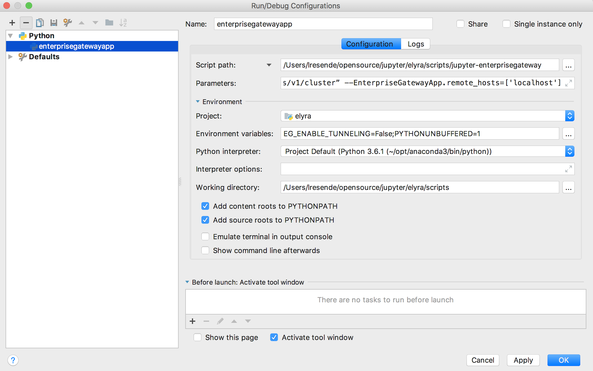

## Debugging Jupyter Enterprise Gateway
This page discusses how to go about debugging Enterprise Gateway.  We also provide troubleshooting information
on our [Troubleshooting](troubleshooting.html) page.

### Configuring your IDE for debugging Jupyter Enterprise Gateway

While your mileage may vary depending on which IDE you are using, the steps below (which was created
using PyChar as an example) should be useful for configuring a debuging session for EG with minimum 
adjustments for different IDEs.

#### Creating a new Debug Configuration

Go to Run->Edit Configuration and create a new python configuration with the following settings:



**Script Path:**
```bash
/Users/lresende/opensource/jupyter/elyra/scripts/jupyter-enterprisegateway
```   

**Parameters:**
```bash
--ip=0.0.0.0
--log-level=DEBUG
--EnterpriseGatewayApp.yarn_endpoint=“http://elyra-fyi-node-1.fyre.ibm.com:8088/ws/v1/cluster”
--EnterpriseGatewayApp.remote_hosts=['localhost']
```

**Environment Variables:**
```bash
EG_ENABLE_TUNNELING=False
```

**Working Directotry:**
```bash
/Users/lresende/opensource/jupyter/elyra/scripts
```


#### Running in debug mode

Now that you have handled the necessary configuration, use Run-Debug and select the debug configuration 
you just created and happy debuging. 
