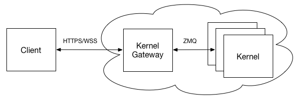

Jupyter Kernel Gateway
======================

Jupyter Kernel Gateway is a web server that supports different mechanisms for
spawning and communicating with Jupyter kernels, such as:

* A Jupyter Notebook server-compatible HTTP API used for requesting kernels
  and talking the `Jupyter kernel protocol <https://jupyter-client.readthedocs.io/en/latest/messaging.html>`_
  with the kernels over Websockets
* A HTTP API defined by annotated notebook cells that maps HTTP verbs and
  resources to code to execute on a kernel

The server launches kernels in its local process/filesystem space. It can be
containerized and scaled out using common technologies like
`tmpnb <https://github.com/jupyter/tmpnb>`_,
`Cloud Foundry <https://github.com/cloudfoundry>`_, and
`Kubernetes <http://kubernetes.io/>`_.

.. toctree::
   :maxdepth: 2
   :caption: User Documentation

   getting-started
   uses
   features
   websocket-mode
   http-mode
   plug-in

.. toctree::
   :maxdepth: 2
   :caption: Configuration

   config-options
   troubleshooting

.. toctree::
   :maxdepth: 2
   :caption: Contributor Documentation

   devinstall

.. toctree::
   :maxdepth: 2
   :caption: Community Documentation

.. toctree::
   :maxdepth: 2
   :caption: About Jupyter Kernel Gateway

   summary-changes

.. toctree::
   :maxdepth: 2
   :caption: Questions? Suggestions?

   Jupyter mailing list <https://groups.google.com/forum/#!forum/jupyter>
   Jupyter website <https://jupyter.org>
   Stack Overflow - Jupyter <https://stackoverflow.com/questions/tagged/jupyter>
   Stack Overflow - Jupyter-notebook <https://stackoverflow.com/questions/tagged/jupyter-notebook>

Indices and tables
==================

* :ref:`genindex`
* :ref:`modindex`
* :ref:`search`

