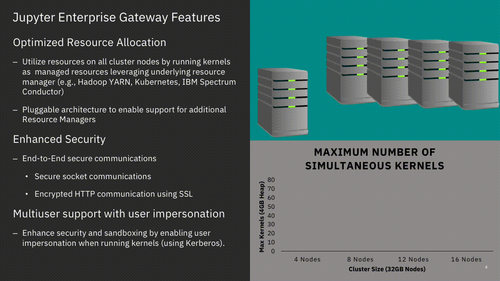

Welcome to Jupyter Enterprise Gateway!
======================================
Jupyter Enterprise Gateway is a headless web server with a pluggable framework
for anyone supporting multiple notebook users in a managed-cluster environment.
Some of the core functionality it provides is better optimization of compute
resources, improved multi-user support, and more granular security for your
Jupyter notebook environment - making it suitable for enterprise, scientific,
and academic implementations.

From a technical perspective, Jupyter Enterprise Gateway is a web server that enables the ability to
launch kernels on behalf of remote notebooks. This leads to better resource
management, as the web server is no longer the single location for kernel activity.  It essentially exposes a *Kernel as a Service* model.

By default, the Jupyter framework runs kernels locally - potentially exhausting the server of resources. By leveraging the functionality of the
underlying resource management applications like Hadoop YARN, Kubernetes, and others, Jupyter Enterprise Gateway
distributes kernels across the compute cluster, dramatically increasing the number of simultaneously active kernels while leveraging the available compute resources.

Kernel Gateway vs. Enterprise Gateway
-------------------------------------
Jupyter Enterprise Gateway was formerly built directly on Jupyter Kernel
Gateway.  At that time, it had complete feature parity with Kernel Gateway.
However, in order to address various roadmap items, Enterprise Gateway removed
its dependency on Kernel Gateway, so now the question arises, when does one
choose Enterprise Gateway over Kernel Gateway?

Use Enterprise Gateway if...
~~~~~~~~~~~~~~~~~~~~~~~~~~~~
1. You have a large compute cluster consisting of limited resources (GPUs, large memory, etc) and users require those resources from notebooks
2. You have large numbers of users requiring access to a shared compute cluster
3. You require some amount of High Availability/Disaster Recovery such that another Gateway server can be spun up to service existing (and remote) kernels

Use Kernel Gateway if...
~~~~~~~~~~~~~~~~~~~~~~~~
1. You have a small user pool where the resources of the Gateway server can be shared amongst those users (no remote kernel support)
2. You wish to configured the `notebook-http mode <https://jupyter-kernel-gateway.readthedocs.io/en/latest/http-mode.html>`_ functionality where a specific Notebook provides HTTP endpoints

Who's this for?
---------------
Jupyter Enterprise Gateway is a highly technical piece of the Jupyter Stack, so we've separated documentation to help specific personas:

1. `Users <users/index.html>`_: people using Jupyter web applications that wish to connect to an Enterprise Gateway instance.
2. `Operators <operators/index.html>`_: people deploying or serving Jupyter Enterprise Gateway to others.
3. `Developers <developers/index.html>`_: people writing applications or deploying kernels for other resource managers.
4. `Contributors <contributors/index.html>`_: people contributing directly to the Jupyter Enterprise Gateway project.

If you find gaps in our documentation, please open an issue (or better yet, a pull request) on the Jupyter Enterprise Gateway `Github repo <https://github.com/jupyter-server/enterprise_gateway>`_.

Table of Contents
-----------------

.. toctree::
   :maxdepth: 2

   Users <users/index>
   Operators <operators/index>
   Developers <developers/index>
   Contributors <contributors/index>
   Other <other/index>
