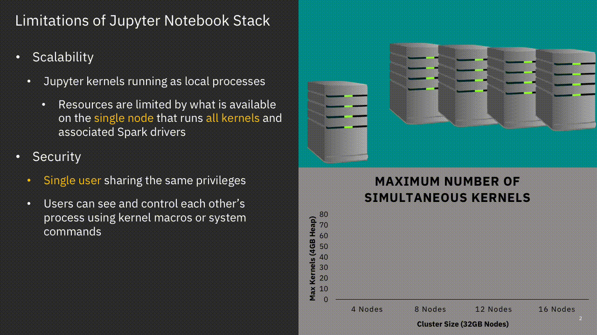

Jupyter Enterprise Gateway
==========================

`Jupyter Enterprise Gateway <https://github.com/jupyter/enterprise_gateway>`_ is a pluggable framework that provides useful functionality for anyone supporting multiple users in a multi-cluster environment. Some of the core functionality it provides is better optimization of compute resources, improved multi-user support, and more granular security for your Jupyter notebook environment--making it suitable for enterprise, scientific, and academic implementations. 

From a technical perspective, Jupyter Enterprise Gateway is a web server that enables the ability to
launch kernels on behalf of remote notebooks. This leads to better resource
management, as the web server is no longer the single location for kernel activity.

By default, Jupyter runs kernels locally - potentially exhausting the server of resources. By leveraging the functionality of the
underlying resource management applications like Hadoop YARN, Kubernetes, etc., Jupyter Enterprise Gateway
distributes kernels across the compute cluster, dramatically increasing the number of simultaneously active kernels.

.. figure:: images/Scalability-After-JEG.gif
   :align: center

Jupyter Enterprise Gateway leverages local resource managers to distribute kernels

.. toctree::
   :maxdepth: 2
   :caption: User Documentation

   getting-started
   system-architecture
   getting-started-security
   getting-started-other-features
   use-cases

.. toctree::
   :maxdepth: 2
   :caption: Deployments

   kernel-local
   kernel-distributed
   kernel-yarn-cluster-mode
   kernel-yarn-client-mode
   kernel-spark-standalone
   kernel-kubernetes
   kernel-docker
   kernel-conductor
   kernel-library

.. toctree::
   :maxdepth: 2
   :caption: Configuration

   config-options
   troubleshooting
   debug

.. toctree::
   :maxdepth: 2
   :caption: Contributor Documentation

   contrib
   devinstall
   docker
   roadmap

.. toctree::
   :maxdepth: 2
   :caption: Community Documentation

   Jupyter mailing list <https://groups.google.com/forum/#!forum/jupyter>
   Jupyter website <https://jupyter.org>
   Stack Overflow - Jupyter <https://stackoverflow.com/questions/tagged/jupyter>
   Stack Overflow - Jupyter-notebook <https://stackoverflow.com/questions/tagged/jupyter-notebook>

