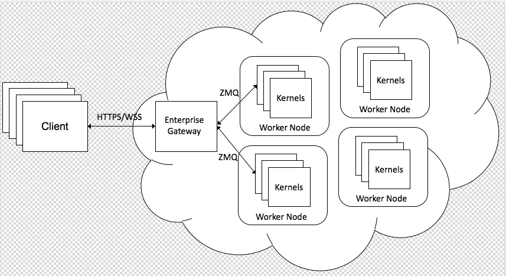

Jupyter Enterprise Gateway
==========================

Jupyter Enterprise Gateway is a web server (built directly on `Jupyter Kernel Gateway
<http://jupyter-kernel-gateway.readthedocs.io/en/latest/>`_) that enables the ability to launch kernels on remote
servers throughout the enterprise.  This enables better resource management since the web server is no longer the
single location for kernel activity, which in Big Data environments, can result in large processes.  By distributing
these resources across the enterprise, some of which can be managed by resource management applications (e.g., Yarn),
the number of active kernels can be dramatically increased.

.. toctree::
   :maxdepth: 2
   :caption: User Documentation

   getting-started
   getting-started-cluster-mode
   getting-started-client-mode
   getting-started-advanced-features

.. toctree::
   :maxdepth: 2
   :caption: Architecture and Design

   use-cases
   system-architecture

.. toctree::
   :maxdepth: 2
   :caption: Configuration

   config-options
   troubleshooting

.. toctree::
   :maxdepth: 2
   :caption: Contributor Documentation

   contrib
   devinstall
   docker
   roadmap

.. toctree::
   :maxdepth: 2
   :caption: Community Documentation

   Jupyter mailing list <https://groups.google.com/forum/#!forum/jupyter>
   Jupyter website <https://jupyter.org>
   Stack Overflow - Jupyter <https://stackoverflow.com/questions/tagged/jupyter>
   Stack Overflow - Jupyter-notebook <https://stackoverflow.com/questions/tagged/jupyter-notebook>

