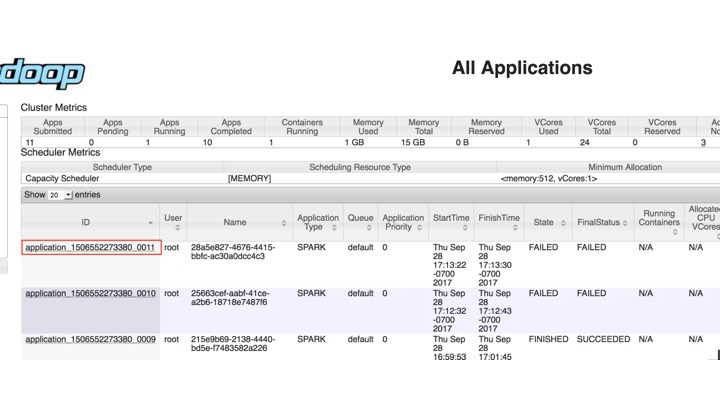

# Troubleshooting Guide

This page identifies scenarios we've encountered when running Enterprise Gateway. We also provide
instructions for setting up a debug environment on our [Debugging Jupyter Enterprise Gateway](../contributors/debug.md) page.

## Fresh Install

Scenario: **I just installed Enterprise Gateway but nothing happens, how do I proceed?**

Because Enterprise Gateway is one element of a networked application, there are various _touch points_ that should
be validated independently. The following items can be used as a checklist to confirm general operability.

1. Confirm that Enterprise Gateway is servicing general requests. This can be accomplished using the following
   `curl` command, which should produce the json corresponding to the configured kernelspecs:
   `bash curl http://<gateway_server>:<gateway_port>/api/kernelspecs `
1. Independently validate any resource manager you're running against. Various resource managers usually provide
   examples for how to go about validating their configuration.
1. Confirm that the Enterprise Gateway arguments for contacting the configured resource manager are in place. These
   should be covered in the deployment section of our Operators Guide.
1. If using a Notebook server as your front-end, ensure that the Gateway configuration options or NB2KG extension settings are properly configured.
   Once the notebook has started, a refresh on the tree view should issue the same `kernelspecs` request in step 1 and
   the drop-down menu items for available kernels should reflect an entry for each kernelspec returned.
1. **Always** consult your Enterprise Gateway log file. If you have not redirected `stdout` and `stderr` to a
   file you are highly encouraged to do so. In addition, you should enable `DEBUG` logging at least until your
   configuration is stable. Please note, however, that you may be asked to produce an Enterprise Gateway log with
   `DEBUG` enabled when reporting issues. An example of output redirection and `DEBUG` logging is also provided in our
   [Operators Guide](../operators/launching-eg.md#launching-enterprise-gateway-common).

## Hadoop YARN Cluster Mode

Scenario: **I'm trying to launch a (Python/Scala/R) kernel in YARN Cluster Mode, but it failed with
a "Kernel error" and State: 'FAILED'.**

1. Check the output from Enterprise Gateway for an error message. If an applicationId was
   generated, make a note of it. For example, you can locate the applicationId
   `application_15065522733.2.3011` from the following snippet of message:
   `[D 2017-09-28 17:13:22.675 EnterpriseGatewayApp] 13: State: 'ACCEPTED', Host: 'burna2.yourcompany.com', KernelID: '28a5e827-4676-4415-bbfc-ac30a0dcc4c3', ApplicationID: 'application_15065522733.2.3011' 17/09/28 17:13:22 INFO YarnClientImpl: Submitted application application_15065522733.2.3011 17/09/28 17:13:22 INFO Client: Application report for application_15065522733.2.3011 (state: ACCEPTED) 17/09/28 17:13:22 INFO Client: client token: N/A diagnostics: AM container is launched, waiting for AM container to Register with RM ApplicationMaster host: N/A ApplicationMaster RPC port: -1 queue: default start time: 1506644002471 final status: UNDEFINED tracking URL: http://burna1.yourcompany.com:8088/proxy/application_15065522733.2.3011/`
1. Lookup the YARN log for that applicationId in the YARN ResourceManager UI: 
1. Drill down from the applicationId to find logs for the failed attempts and take appropriate
   actions. For example, for the error below,
   ```
   Traceback (most recent call last):
    File "launch_ipykernel.py", line 7, in <module>
      from ipython_genutils.py3compat import str_to_bytes
    ImportError: No module named ipython_genutils.py3compat
   ```
   Simply running "pip install ipython_genutils" should fix the problem. If Anaconda is
   installed, make sure the environment variable for Python, i.e. `PYSPARK_PYTHON`, is
   properly configured in the kernelspec and matches the actual Anaconda installation
   directory.

## SSH Permissions

Scenario: **I'm trying to launch a (Python/Scala/R) kernel in YARN Client Mode, but it failed with
a "Kernel error" and an `AuthenticationException`.**

```
[E 2017-09-29 11:13:23.277 EnterpriseGatewayApp] Exception 'AuthenticationException' occurred
when creating a SSHClient connecting to 'xxx.xxx.xxx.xxx' with user 'elyra',
message='Authentication failed.'.
```

This error indicates that the password-less ssh may not be properly configured. Password-less
ssh needs to be configured on the node that the Enterprise Gateway is running on to all other
worker nodes.

You might also see an `SSHException` indicating a similar issue.

```
[E 2017-09-29 11:13:23.277 EnterpriseGatewayApp] Exception 'SSHException' occurred
when creating a SSHClient connecting to 'xxx.xxx.xxx.xxx' with user 'elyra',
message='No authentication methods available.'.
```

In general, you can look for more information in the kernel log for YARN Client
kernels. The default location is /tmp with a filename of `kernel-<kernel_id>.log`. The location
can be configured using the environment variable `EG_KERNEL_LOG_DIR` during Enterprise Gateway start up.

```{seealso}
[Launching Enterprise Gateway](../operators/launching-eg.md#launching-enterprise-gateway-common) for an
example of starting the Enterprise Gateway from a script and the
[Operators Guide](../operators/config-add-env.md#additional-environment-variables)
for a list of configurable environment variables.
```

## SSH Tunneling

Scenario: **I'm trying to launch a (Python/Scala/R) kernel in YARN Client Mode with SSH tunneling enabled,
but it failed with a "Kernel error" and a SSHException.**

```
[E 2017-10-26 11:48:20.922 EnterpriseGatewayApp] The following exception occurred waiting
for connection file response for KernelId 'da3d0dde-9de1-44b1-b1b4-e6f3cf52dfb9' on host
'remote-host-name': The authenticity of the host can't be established.
```

This error indicates that fingerprint for the ECDSA key of the remote host has not been added
to the list of known hosts from where the SSH tunnel is being established.

For example, if the Enterprise Gateway is running on `node1` under service-user `jdoe` and
environment variable `EG_REMOTE_HOSTS` is set to `node2,node3,node4`, then the Kernels can be
launched on any of those hosts and a SSH tunnel will be established between `node1` and
any of the those hosts.

To address this issue, you need to perform a one-time step that requires you to login to
`node1` as `jdoe` and manually SSH into each of the remote hosts and accept the fingerprint
of the ECDSA key of the remote host to be added to the list of known hosts as shown below:

```
[jdoe@node1 ~]$ ssh node2
The authenticity of host 'node2 (172.16.207.191)' can't be established.
ECDSA key fingerprint is SHA256:Mqi3txf4YiRC9nXg8a/4gQq5vC4SjWmcN1V5Z0+nhZg.
ECDSA key fingerprint is MD5:bc:4b:b2:39:07:98:c1:0b:b4:c3:24:38:92:7a:2d:ef.
Are you sure you want to continue connecting (yes/no)? yes
Warning: Permanently added 'node2,172.16.207.191' (ECDSA) to the list of known hosts.
[jdoe@node2 ~] exit
```

Repeat the aforementioned step as `jdoe` on `node1` for each of the hosts listed in
`EG_REMOTE_HOSTS` and restart Enterprise Gateway.

## Kernel Encounters `TypeError`

Scenario: **I'm trying to launch a (Python/Scala/R) kernel, but it failed with `TypeError: Incorrect padding`.**

```
Traceback (most recent call last):
  File "/opt/conda/lib/python3.8/site-packages/tornado/web.py", line 1512, in _execute
    result = yield result
  File "/opt/conda/lib/python3.8/site-packages/tornado/gen.py", line 1055, in run
    value = future.result()
  ...
  ...
  File "/opt/conda/lib/python3.8/site-packages/enterprise_gateway/services/kernels/remotemanager.py", line 125, in _launch_kernel
    return self.process_proxy.launch_process(kernel_cmd, **kw)
  File "/opt/conda/lib/python3.8/site-packages/enterprise_gateway/services/processproxies/yarn.py", line 63, in launch_process
    self.confirm_remote_startup(kernel_cmd, **kw)
  File "/opt/conda/lib/python3.8/site-packages/enterprise_gateway/services/processproxies/yarn.py", line 174, in confirm_remote_startup
    ready_to_connect = self.receive_connection_info()
  File "/opt/conda/lib/python3.8/site-packages/enterprise_gateway/services/processproxies/processproxy.py", line 565, in receive_connection_info
    raise e
TypeError: Incorrect padding
```

To address this issue, first ensure that the launchers used for each kernel are derived
from the same release as the Enterprise Gateway server. Next ensure that `pycryptodomex 3.9.7`
or later is installed on all hosts using either `pip install` or `conda install` as shown below:

```
[jdoe@node1 ~]$ pip uninstall pycryptodomex
[jdoe@node1 ~]$ pip install pycryptodomex
```

or

```
[jdoe@node1 ~]$ conda install pycryptodomex
```

This should be done on the host running Enterprise Gateway as well as all the remote hosts
on which the kernel is launched.

## Port Range

Scenario: **I'm trying to launch a (Python/Scala/R) kernel with port range, but it failed with `RuntimeError: Invalid port range `.**

```
Traceback (most recent call last):
  File "/opt/conda/lib/python3.8/site-packages/tornado/web.py", line 1511, in _execute
    result = yield result
  File "/opt/conda/lib/python3.8/site-packages/tornado/gen.py", line 1055, in run
    value = future.result()
  ....
  ....
  File "/opt/conda/lib/python3.8/site-packages/enterprise_gateway/services/processproxies/processproxy.py", line 478, in __init__
    super(RemoteProcessProxy, self).__init__(kernel_manager, proxy_config)
  File "/opt/conda/lib/python3.8/site-packages/enterprise_gateway/services/processproxies/processproxy.py", line 87, in __init__
    self._validate_port_range(proxy_config)
  File "/opt/conda/lib/python3.8/site-packages/enterprise_gateway/services/processproxies/processproxy.py", line 407, in _validate_port_range
    "port numbers is (1024, 65535).".format(self.lower_port))
RuntimeError: Invalid port range '1000..2000' specified. Range for valid port numbers is (1024, 65535).
```

To address this issue, make sure that the specified port range does not overlap with TCP's well-known
port range of (0, 1024\].

## Hadoop YARN Timeout

Scenario: **I'm trying to launch a (Python/Scala/R) kernel, but it times out and the YARN application status remain `ACCEPTED`.**

Enterprise Gateway log from server will look like the one below, and will complain that there are no resources:
`launch timeout due to: YARN resources unavailable`

```bash
    State: 'ACCEPTED', Host: '', KernelID: '3181db50-8bb5-4f91-8556-988895f63efa', ApplicationID: 'application_1537119233094_0001'
    State: 'ACCEPTED', Host: '', KernelID: '3181db50-8bb5-4f91-8556-988895f63efa', ApplicationID: 'application_1537119233094_0001'
  ...
  ...
    SIGKILL signal sent to pid: 19690
    YarnClusterProcessProxy.kill, application ID: application_1537119233094_0001, kernel ID: 3181db50-8bb5-4f91-8556-988895f63efa, state: ACCEPTED
    KernelID: '3181db50-8bb5-4f91-8556-988895f63efa' launch timeout due to: YARN resources unavailable after 61.0 seconds for app application_1537119233094_0001, launch timeout: 60.0!  Check YARN configuration.
```

The most common cause for this is that YARN Resource Managers are failing to start and the cluster see no resources available.
Make sure YARN Resource Managerss are running ok. We have also noticed that, in Kerborized environments, sometimes there are
issues with directory access rights that cause the YARN Resource Managers to fail to start and this can be corrected by validating
the existence of `/hadoop/yarn` and that it's owned by `yarn: hadoop`.

## Kernel Resources

Scenario: **My kernel keeps dying when processing jobs that require large amount of resources (e.g. large files)**

This is usually seen when you are trying to use more resources then what is available for your kernel.
To address this issue, increase the amount of memory available for your Hadoop YARN application or another
resource manager managing the kernel. For example, on Kubernetes, this may be a time when the kernel specification's [kernel-pod.yaml.j2](https://github.com/jupyter-server/enterprise_gateway/blob/main/etc/kernel-launchers/kubernetes/scripts/kernel-pod.yaml.j2) file should be extended with resource quotas.

## Kerberos

Scenario: **I'm trying to use a notebook with user impersonation on a Kerberos enabled cluster, but it fails to authenticate.**

When using user impersonation in a YARN cluster with Kerberos authentication, if Kerberos is not
setup properly you will usually see the following warning in your Enterprise Gateway log that will keep a notebook from connecting:

```bash
  WARN Client: Exception encountered while connecting to the server : javax.security.sasl.SaslException: GSS initiate failed
    [Caused by GSSException: No valid credentials provided (Mechanism level: Failed to find any Kerberos tgt)]
```

The most common cause for this WARN is when the user that started Enterprise Gateway is not authenticated
with Kerberos. This can happen when the user has either not run `kinit` or their previous ticket has expired.

## Openshift Kubernetes

Scenario: **Running Jupyter Enterprise Gateway on OpenShift Kubernetes Environment fails trying to create /home/jovyan/.local**

As described [in the OpenShift Admin Guide](https://docs.openshift.com/container-platform/4.10/openshift_images/create-images.html)
there is a need to issue the following command to enable running with `USER` in Dockerfile.

```bash
oc adm policy add-scc-to-group anyuid system:authenticated
```

## Opening an issue

Scenario: **None of the scenarios on this page match or resolve my issue, what do I do next?**

If you are unable to resolve your issue, take a look at our
[open issues list](https://github.com/jupyter-server/enterprise_gateway/issues) to see if there is an applicable scenario
already reported. If found, please add a comment to the issue so that we can get a sense of urgency (although all
issues are important to us). If not found, please provide the following information if possible in a **new issue**.

1. Describe the issue in as much detail as possible. This should include configuration information about your environment.
1. Gather and _attach_ the following files to the issue. If possible, please archive the files first.
   1. The **complete** Enterprise Gateway log file. If possible, please enable `DEBUG` logging that encompasses
      the issue. You can refer to this section of our [Operators Guide](../operators/launching-eg.md#launching-enterprise-gateway-common)
      for redirection and `DEBUG` enablement.
   1. The log file(s) produced from the corresponding kernel. This is primarily a function of the underlying resource
      manager.
      - For containerized installations like Kubernetes or Docker Swarm, kernel log output can be captured by
        running the appropriate `logs` command against the pod or container, respectively. The names of the
        corresponding pod/container can be found in the Enterprise Gateway log.
      - For `Hadoop YARN` environments,
        you'll need to navigate to the appropriate log directory relative the application ID associated with the kernel.
        The application ID can be located in the Enterprise Gateway log. If you have access to an administrative console,
        you can usually navigate to the application logs more easily.
   1. Although unlikely, the notebook log may also be helpful. If we find that the issue is more client-side
      related, we may ask for `DEBUG` logging there as well.
1. If you have altered or created new kernel specifications, the files corresponding to the failing kernels would be
   helpful. These files could also be added to the attached archive or attached separately.

Please know that we understand that some information cannot be provided due to its sensitivity. In such cases, just
let us know and we'll be happy to approach the resolution of your issue from a different angle.
