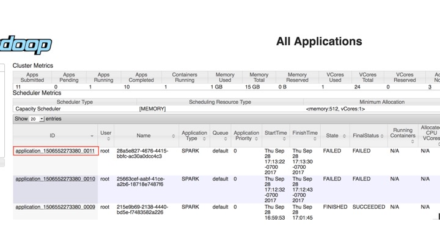

## Troubleshooting

- **I'm trying to launch a (Python/Scala/R) kernel in YARN Cluster Mode but it failed with 
a "Kernel error" and State: 'FAILED'.**

    1. Check the output from Enterprise Gateway for an error message.  If an applicationId was 
    generated, make a note of it.  For example, you can locate the applicationId 
    `application_1506552273380_0011` from the following snippet of message:
        ```
        [D 2017-09-28 17:13:22.675 EnterpriseGatewayApp] 13: State: 'ACCEPTED', Host: 'burna2.yourcompany.com', KernelID: '28a5e827-4676-4415-bbfc-ac30a0dcc4c3', ApplicationID: 'application_1506552273380_0011'
        17/09/28 17:13:22 INFO YarnClientImpl: Submitted application application_1506552273380_0011
        17/09/28 17:13:22 INFO Client: Application report for application_1506552273380_0011 (state: ACCEPTED)
        17/09/28 17:13:22 INFO Client: 
            client token: N/A
            diagnostics: AM container is launched, waiting for AM container to Register with RM
            ApplicationMaster host: N/A
            ApplicationMaster RPC port: -1
            queue: default
            start time: 1506644002471
            final status: UNDEFINED
            tracking URL: http://burna1.yourcompany.com:8088/proxy/application_1506552273380_0011/
        ```
    2. Lookup the YARN log for that applicationId in the YARN ResourceManager UI: 
    3. Drill down from the applicationId to find logs for the failed attempts and take appropriate
     actions. For example, for the error below, 
        ```
        Traceback (most recent call last):
         File "launch_ipykernel.py", line 7, in <module>
           from ipython_genutils.py3compat import str_to_bytes
         ImportError: No module named ipython_genutils.py3compat
        ```
        Simply running "pip install ipython_genutils" should fix the problem.  If Anaconda is 
        installed, make sure the environment variable for Python, i.e. `PYSPARK_PYTHON`, is 
        properly configured in the kernelspec and matches the actual Anaconda installation 
        directory.   


- **I'm trying to launch a (Python/Scala/R) kernel in YARN Client Mode but it failed with 
a "Kernel error" and an `AuthenticationException`.**
    ```
    [E 2017-09-29 11:13:23.277 EnterpriseGatewayApp] Exception 'AuthenticationException' occurred 
    when creating a SSHClient connecting to 'xxx.xxx.xxx.xxx' with user 'elyra', 
    message='Authentication failed.'.
    ```
    
    This error indicates that the password-less ssh may not be properly configured.  Password-less 
    ssh needs to be configured on the node that the Enterprise Gateway is running on to all other 
    worker nodes.
    
    You might also see an `SSHException` indicating a similar issue.
    ```
    [E 2017-09-29 11:13:23.277 EnterpriseGatewayApp] Exception 'SSHException' occurred 
    when creating a SSHClient connecting to 'xxx.xxx.xxx.xxx' with user 'elyra', 
    message='No authentication methods available.'.
    ```


 In general, you can look for more information in the proxy launch log for YARN Client 
 kernels.  The default location is /tmp/jeg_proxy_launch.log and it can be configured 
 using the environment variable `EG_PROXY_LAUNCH_LOG` during Enterprise Gateway start up. 
 
 See [Starting Enterprise Gateway](getting-started.html#starting-enterprise-gateway) for an 
 example of starting the Enterprise Gateway from a script and 
 [Supported Environment Variables](config-options.html#supported-environment-variables) 
 for a list of configurable environment variables.   


