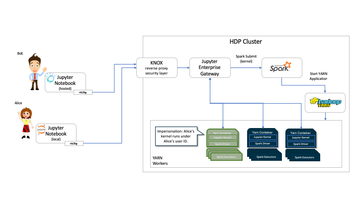
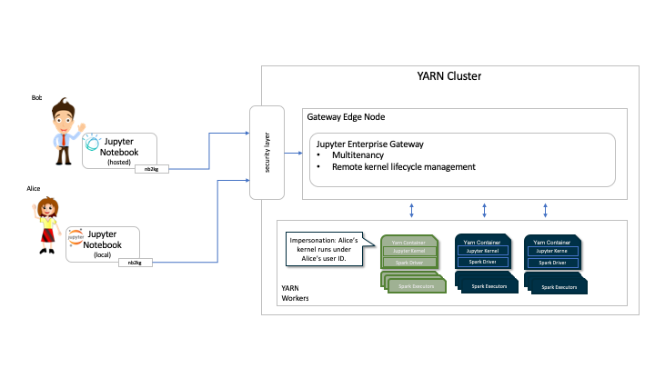

The Big Data Analytics use cases require processing large data sets which are not containable by
the resources available on a single machine.

Jupyter Enterprise Gateway extends the Jupyter Notebook platform and enables Jupyter Notebook
kernels to run as Apache Spark applications in YARN cluster mode.

By leveraging the functionality
of the underlying resource management applications like Hadoop YARN, etc., Jupyter Enterprise Gateway
distributes kernels across the compute cluster, dramatically increasing the number of simultaneously
active notebooks/kernels.

 

### Deployment

 

Jupyter Enterprise Gateway can easily be incorporated into your Analytics Platform.

If you are using a distribution like HDP, the gateway can be installed in an edge node
(optionally secured by Knox). Jupyter Notebooks can then connect via the gateway and
have access to run the Notebook kernels in the Spark/YARN nodes. If you have Kerberos
security enable on the cluster, then each notebook kernel will be running as the userid
from the users that requested the notebook kernel, thus leveraging all configured ACLs
when accessing HDFS, and other secured resources.

  

Note that the use of a distribution is not a requirement, and we also support running
Jupyter Enterprise Gateway in a vanilla deployment of Spark and YARN.

  

#### Deployment Scripts

 

The Jupyter Enterprise Gateway development team uses some Ansible scripts for provisioning
test environments, these scripts might be useful for users trying to get started with the gateway.

- Ansible Deployment scripts : <a href="https://github.com/lresende/ansible-spark-cluster">ansible-spark-cluster</a>
